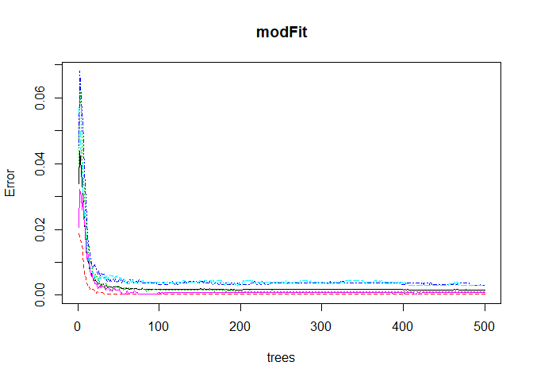

Introduction
------------

###### Using devices such as Jawbone Up, Nike FuelBand, and Fitbit it is now possible to collect a large amount of data about personal activity relatively inexpensively. These type of devices are part of the quantified self movement – a group of enthusiasts who take measurements about themselves regularly to improve their health, to find patterns in their behavior, or because they are tech geeks. One thing that people regularly do is quantify how much of a particular activity they do, but they rarely quantify how well they do it. In this project, your goal will be to use data from accelerometers on the belt, forearm, arm, and dumbell of 6 participants. They were asked to perform barbell lifts correctly and incorrectly in 5 different ways. More information is available from the website here: <http://groupware.les.inf.puc-rio.br/har> (see the section on the Weight Lifting Exercise Dataset).

Aim
---

###### The goal is to use data from accelerometers on the belt, forearm, arm, and dumbell of 6 participants that were asked to perform barbell lifts correctly and incorrectly in 5 different ways to predict the manner in which they did the exercise.

#### Load libraries

    library(caret)

    ## Loading required package: lattice

    ## Loading required package: ggplot2

    library(randomForest)

    ## randomForest 4.6-14

    ## Type rfNews() to see new features/changes/bug fixes.

    ## 
    ## Attaching package: 'randomForest'

    ## The following object is masked from 'package:ggplot2':
    ## 
    ##     margin

    library(e1071)

#### Load and Clean Data

    set.seed(12345)
    training <- read.csv('pml-training.csv', na.strings=c("NA","#DIV/0!",""))
    testing <- read.csv('pml-testing.csv', na.strings=c("NA","#DIV/0!",""))

#### Cross validation set

###### The training set is divided in two parts, one for training and the other for cross validation

    inTrain <- createDataPartition(training$classe, p=0.7, list=FALSE)
    myTraining <- training[inTrain, ]
    myTesting <- training[-inTrain, ]
    dim(myTraining); dim(myTesting)

    ## [1] 13737   160

    ## [1] 5885  160

##### Cleaning the data

###### Remove NearZeroVariance variables

    nzv <- nearZeroVar(myTraining, saveMetrics=TRUE)
    myTraining <- myTraining[,nzv$nzv==FALSE]
    nzv<- nearZeroVar(myTesting,saveMetrics=TRUE)
    myTesting <- myTesting[,nzv$nzv==FALSE]

Remove the first column of the myTraining data set

    myTraining <- myTraining[c(-1)]

###### Clean variables with more than 70% NA

    trainingV3 <- myTraining
    for(i in 1:length(myTraining)) {
        if( sum( is.na( myTraining[, i] ) ) /nrow(myTraining) >= .7) {
            for(j in 1:length(trainingV3)) {
                if( length( grep(names(myTraining[i]), names(trainingV3)[j]) ) == 1)  {
                    trainingV3 <- trainingV3[ , -j]
                }   
            } 
        }
    }
    # Set back to the original variable name
    myTraining <- trainingV3
    rm(trainingV3)

###### Transform the myTesting and testing data sets

    clean1 <- colnames(myTraining)
    clean2 <- colnames(myTraining[, -58])  # remove the classe column
    myTesting <- myTesting[clean1]         # allow only variables in myTesting that are also in myTraining
    testing <- testing[clean2]             # allow only variables in testing that are also in myTraining
    dim(myTesting)

    ## [1] 5885   58

    dim(testing)

    ## [1] 20 57

###### Merge the data into the same type

    for (i in 1:length(testing) ) {
        for(j in 1:length(myTraining)) {
            if( length( grep(names(myTraining[i]), names(testing)[j]) ) == 1)  {
                class(testing[j]) <- class(myTraining[i])
            }      
        }      
    }
    # To get the same class between testing and myTraining
    testing <- rbind(myTraining[2, -58] , testing)
    testing <- testing[-1,]

#### Train Model

###### Fit a model using random forest with a cross validation of 5 folds to avoid overfitting.

    set.seed(12345)
    modFit <- randomForest(classe ~ ., data=myTraining)
    modFit

    ## 
    ## Call:
    ##  randomForest(formula = classe ~ ., data = myTraining) 
    ##                Type of random forest: classification
    ##                      Number of trees: 500
    ## No. of variables tried at each split: 7
    ## 
    ##         OOB estimate of  error rate: 0.15%
    ## Confusion matrix:
    ##      A    B    C    D    E  class.error
    ## A 3905    1    0    0    0 0.0002560164
    ## B    3 2655    0    0    0 0.0011286682
    ## C    0    5 2389    2    0 0.0029215359
    ## D    0    0    5 2245    2 0.0031083481
    ## E    0    0    0    2 2523 0.0007920792

###### The figure shows the plot of modFit

    plot(modFit)

\#\#\#\# Cross Validation Testing \#\#\#\#\#\# Predict on cross
validation dataset by applying our training model to check for accuracy.

    predRF <- predict(modFit, myTesting, type = "class")
    crossPred <- confusionMatrix(predRF, myTesting$classe)
    crossPred

    ## Confusion Matrix and Statistics
    ## 
    ##           Reference
    ## Prediction    A    B    C    D    E
    ##          A 1673    0    0    0    0
    ##          B    1 1139    1    0    0
    ##          C    0    0 1023    0    0
    ##          D    0    0    2  964    2
    ##          E    0    0    0    0 1080
    ## 
    ## Overall Statistics
    ##                                           
    ##                Accuracy : 0.999           
    ##                  95% CI : (0.9978, 0.9996)
    ##     No Information Rate : 0.2845          
    ##     P-Value [Acc > NIR] : < 2.2e-16       
    ##                                           
    ##                   Kappa : 0.9987          
    ##                                           
    ##  Mcnemar's Test P-Value : NA              
    ## 
    ## Statistics by Class:
    ## 
    ##                      Class: A Class: B Class: C Class: D Class: E
    ## Sensitivity            0.9994   1.0000   0.9971   1.0000   0.9982
    ## Specificity            1.0000   0.9996   1.0000   0.9992   1.0000
    ## Pos Pred Value         1.0000   0.9982   1.0000   0.9959   1.0000
    ## Neg Pred Value         0.9998   1.0000   0.9994   1.0000   0.9996
    ## Prevalence             0.2845   0.1935   0.1743   0.1638   0.1839
    ## Detection Rate         0.2843   0.1935   0.1738   0.1638   0.1835
    ## Detection Prevalence   0.2843   0.1939   0.1738   0.1645   0.1835
    ## Balanced Accuracy      0.9997   0.9998   0.9985   0.9996   0.9991

#### Accuracy and Estimated Out of Sample Error

    accur <- postResample(myTesting$classe, predRF)
    modAccuracy <- accur[[1]]
    modAccuracy

    ## [1] 0.9989805

    out_of_sample_error <- 1 - modAccuracy
    out_of_sample_error

    ## [1] 0.001019541

###### The estimated accuracy of the model is 99.9% and the estimated out-of-sample error based on our fitted model applied to the cross validation dataset is 0.1%.

#### Predicting Results on the Test Data

    predTest <- predict(modFit, testing)
    predTest

    ##  1  2 31  4  5  6  7  8  9 10 11 12 13 14 15 16 17 18 19 20 
    ##  B  A  B  A  A  E  D  B  A  A  B  C  B  A  E  E  A  B  B  B 
    ## Levels: A B C D E
